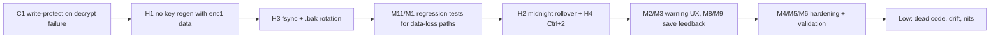

# ChronoWard v2.0.5 — Code Review Report

**Stage:** 06 Code Review · **Date:** 2026-10-04 · **Scope:** `src/`, `src-tauri/src/`, Tauri config/capabilities, `tests/`
**Checks run:** `npm test` → 7/7 pass. `cargo test` **not run** on purpose (see M1: a test reads/creates the production keychain key).

## Summary

| Severity | Count | Theme |
| :--- | :---: | :--- |
| 🔴 Critical | 1 | Silent overwrite of encrypted history after a decrypt failure |
| 🟠 High | 4 | Keychain-loss key regeneration, midnight rollover, Ctrl+2 crash, non-durable writes |
| 🟡 Medium | 11 | Focus stealing, XSS hardening, input validation, save ordering/feedback, test coverage |
| ⚪ Low | 14 | Dead code, doc/schema drift, small correctness issues |

The architecture is sound overall. Strengths: atomic write-and-rename, a serialised write lock, emergency read-only mode, AES-GCM with a fresh random nonce per write, `connect-src 'none'`, pinned dependencies, poisoned-mutex recovery (`into_inner`), and main-table rows built with `createElement` instead of `innerHTML`.
The serious problems sit **between** layers. The backend reports a failure, the frontend treats it as "no data", and the next save overwrites the user's history.

---

## 🔴 Critical

### C1. Decrypt failure → empty sheet → encrypted history overwritten
**Where:** [app.js L48-63](../../../src/app.js#L48-L63), [sheets.rs L63-70](../../../src-tauri/src/commands/sheets.rs#L63-L70), [state.rs `guard_write!` L274-283](../../../src-tauri/src/state.rs#L274-L283), [app.js `saveCurrentSheet` L529-540](../../../src/app.js#L529-L540)

**Trace:**
1. `load_sheets` fails to decrypt (key changed, file truncated, bit-rot, see H1/H2). It returns `{ ok:false, code:"DECRYPT_FAILED" }` and sets no flag.
2. `init()` only checks for `EMERGENCY_MODE`. Every other `ok:false` goes to the `else` branch, where `sheets = sheetsResult.data || {}` evaluates to `{}`. The user sees no warning.
3. `loadSheetForDate` adds a blank row. The first blur, stepper click or timer stop calls `saveCurrentSheet()`, which sends `save_sheets({ [today]: [...] })`.
4. `guard_write!` only checks `emergency_mode`, which is set once at startup. The write goes through and **the only copy of the user's full history is replaced**.

`settings.rs` [L55-58](../../../src-tauri/src/commands/settings.rs#L55-L58) and `timers.rs` [L43-46](../../../src-tauri/src/commands/timers.rs#L43-L46) do the same thing: they quietly return defaults, which get saved on the next write.

**Fix (both layers):**
- Backend: add a per-file runtime `write_protected` flag (`AtomicBool`) that is set on any decrypt or parse failure. Have `guard_write!` and the save commands check it. Before allowing any write, copy the unreadable original to `*.corrupt.<ts>` (the same way JSON-parse failures are handled now).
- Frontend: treat **any** `ok:false` as read-only. Show a persistent banner that names the error code.
- Add a regression test: corrupt the `sheets.json` ciphertext → `load_sheets` → `save_sheets` must fail and the original bytes must still be on disk.

---

## 🟠 High

### H1. Lost keychain entry silently creates a new key while encrypted data exists
**Where:** [crypto.rs L85-95](../../../src-tauri/src/crypto.rs#L85-L95), [lib.rs L31-45](../../../src-tauri/src/lib.rs#L31-L45)

`ensure_key_exists()` generates and stores a fresh key on `NoEntry` and never checks whether `enc1:` files are already on disk. This can happen after a Credential Manager wipe, a profile migration, or a machine restore. The old data becomes undecryptable for good, `is_new_key=true` turns the downgrade defence off for the session, and C1 then overwrites the files.
**Fix:** run `check_encrypted_data_exists()` **before** probing. If the entry is `NoEntry` and encrypted data exists, return `Unavailable("key missing for existing encrypted data")` so emergency mode engages. Never generate a key in that state.

### H2. `currentDate` freezes at launch, so the app breaks after midnight
**Where:** [app.js L69](../../../src/app.js#L69), [L208-210](../../../src/app.js#L208-L210), [L1414-1416](../../../src/app.js#L1414-L1416), [L1419-1420](../../../src/app.js#L1419-L1420)

ChronoWard autostarts and lives in the tray, so it often runs for days. After the first midnight, `currentDate === getTodayString()` is always false. The **hours warning stops firing**, Pomodoro and new rows go into yesterday's sheet, and the weekly theme rotation is never recalculated.
**Fix:** check once a minute for a date change. If the user was viewing the old "today", save and move to the new today. Also recalculate the theme.

### H3. Non-durable atomic write; no backup of the only data file
**Where:** [settings.rs `atomic_write` L126-141](../../../src-tauri/src/commands/settings.rs#L126-L141)

The code writes the temp file and renames it without `sync_all()`. On power loss, NTFS/ext4 can leave the renamed file empty or partly written, and that feeds straight into C1. No previous generation is kept either.
**Fix:** open the temp file → `write_all` → `sync_all()` → rename → (on Unix) fsync the directory. Keep a rotating `sheets.json.bak` (the last good ciphertext) and fall back to it when decryption fails.

### H4. Ctrl+2 blanks the whole UI
**Where:** [app.js L1539-1545](../../../src/app.js#L1539-L1545), [app.js `switchView` L426-434](../../../src/app.js#L426-L434), [index.html L417](../../../src/index.html#L417)

The views array still contains `'import'`, which was removed. `switchView` removes `active` from every view and nav button, then throws on `getElementById('view-import')` returning null. The user is left with an empty main pane.
**Fix:** use `['timesheet','timesheets-view','settings']`, make `switchView` return early on unknown IDs, and update the shortcut help text.

---

## 🟡 Medium

| ID | Finding | Where | Recommended fix |
| :--- | :--- | :--- | :--- |
| M1 | **Rust test touches the production keychain.** `test_two_encryptions_produce_different_ciphertext` calls `probe_keychain()`, which reads or **creates** the real `com.chronoward.app` key on any dev or CI machine. `test_enc1_roundtrip_via_internal_functions` re-implements AES directly and never calls `encrypt()`/`decrypt()`. | [crypto.rs L244-269, L325-339](../../../src-tauri/src/crypto.rs#L244-L339) | Test `encrypt`/`decrypt` with an in-memory `SecretVec`. Put keychain tests behind `#[ignore]` or use a test-only service name. |
| M2 | **Hours warning steals focus every minute.** `showBanner` emits `warning-active`, and [lib.rs L170-176](../../../src-tauri/src/lib.rs#L170-L176) then calls `show`+`unminimize`+`set_focus`. This fires twice a minute (scheduler + the 60 s JS interval) and sets always-on-top. Keystrokes typed into other apps land in ChronoWard. This conflicts with the "zero-stress / PDA-friendly" invariant. | [app.js L1437-1446](../../../src/app.js#L1437-L1446), [scheduler.rs L113-133](../../../src-tauri/src/scheduler.rs#L113-L133), [app.js L1412-1417](../../../src/app.js#L1412-L1417) | Surface the window once per threshold crossing. After that use `request_user_attention` (taskbar flash) or the overlay, without focusing. Remove the duplicate JS interval. |
| M3 | **Always-on-top stays on after leaving today.** `checkHoursWarning` returns early when `currentDate !== today` without calling `hideBanner()`, so the banner and always-on-top stay active while viewing other dates. | [app.js L1419-1420](../../../src/app.js#L1419-L1420) | Call `hideBanner()` on the early-return path. |
| M4 | **XSS blast radius.** CSP allows `script-src 'unsafe-inline'` (needed only because `hud.html`/`overlay.html` use inline scripts), `withGlobalTauri: true`, and every custom command is callable from every window (no app-command ACL). Any HTML injection gets full IPC, including `save_sheets`. | [tauri.conf.json L11-13](../../../src-tauri/tauri.conf.json#L11-L13), [hud.html L191](../../../src/hud.html#L191), [overlay.html L93](../../../src/overlay.html#L93) | Move inline scripts into `.js` modules and drop `'unsafe-inline'` from `script-src`. Restrict commands per window with the `build.rs` app manifest and capability permissions (the HUD needs only `hide_hud_cmd` and `load_settings`). |
| M5 | **Unvalidated cross-window payload reaches an `innerHTML` sink.** `hud-entry-added` rows are pushed into `sheets` as-is, and `payload.date` can be any key (`''`, `__proto__`). The range view writes `${r.hours}` into `innerHTML` without escaping. | [app.js L224-238](../../../src/app.js#L224-L238), [app.js L1289](../../../src/app.js#L1289) | Check `date` against `^\d{4}-\d{2}-\d{2}$`, build a fresh row object with typed or coerced fields, and escape or `Number()` every interpolated value. |
| M6 | **Hours input not validated.** `min`/`max` attributes don't stop typed values, so negative or >24 hours are saved (main table and HUD). | [app.js L548](../../../src/app.js#L548), [hud.html L220](../../../src/hud.html#L220) | Clamp to `[0, 24]` in `collectRows` and the HUD. Optionally validate again in Rust (typed `Row` struct instead of `serde_json::Value`). |
| M7 | **Save ordering is not guaranteed.** Saves are fire-and-forget, and concurrent `save_sheets` calls race for `write_lock` as separate async tasks, so an older snapshot can land last. Each save also re-serialises and encrypts the entire multi-year history. | [app.js L529-540](../../../src/app.js#L529-L540), [sheets.rs L100-118](../../../src-tauri/src/commands/sheets.rs#L100-L118) | Single in-flight save plus a "dirty" re-queue on the frontend, or a monotonic revision number the backend uses to drop stale writes. |
| M8 | **Save failures are invisible.** Ctrl+S shows "saved to disk" before the result comes back. Every other save failure only goes to `console.error`. | [app.js L1563-1569](../../../src/app.js#L1563-L1569), [app.js L325, L442, L458](../../../src/app.js#L325) | Await the result and show a toast or banner for both success and error. |
| M9 | **HUD reports "Logged!" with no acknowledgement.** The entry is a fire-and-forget event. If the main renderer is in read-only mode or hasn't loaded, the entry is lost silently. | [hud.html L244-252](../../../src/hud.html#L244-L252) | Have the main window reply with `hud-entry-saved`/`-failed` (or persist through a backend command) and show the real result. |
| M10 | **Theme rotation never advances for most users.** `installedAt` is only written as a side effect of some other settings save. Users who never touch settings get `W=0` on every launch. | [app.js L72-75](../../../src/app.js#L72-L75) | Save `installedAt` immediately when it's missing (if not read-only), or set it on the backend in `load_settings`. |
| M11 | **Test coverage doesn't match the risk.** Only 7 frontend tests, all on `utils.js`. `scripts/run_tests.ps1` never runs `cargo test`. No test covers decrypt failure, keychain loss, timer rounding, the HUD payload or midnight rollover. Stage 04's "100% pass" says nothing about coverage. | [tests/utils.test.js](../../../tests/utils.test.js), [run_tests.ps1](../../scripts/run_tests.ps1) | Add Rust tests for C1/H1/H3 using a temp dir and an injected key, and JS tests for `stopTimer` rounding and HUD row validation. Run both suites from the script. |

---

## ⚪ Low

| ID | Finding | Where |
| :--- | :--- | :--- |
| L1 | **Dead code adds IPC surface.** `api.exportCSVFile` (wrong args, would fail if called), `minimizeToTray`, `setAlwaysOnTop`, `setWarningActive`, `listenEvent`. `parseCSV`, `copyTaskText`, `showImportedDesc`. Registered but unused commands `import_csv`, `get_data_dir`, `show_overlay_cmd`. The `overlay-clicked` listener. `hours-updated` is emitted but nothing listens. | [api.js L38-63](../../../src/api.js#L38-L63), [app.js L1343-1409](../../../src/app.js#L1343-L1409), [lib.rs L80-91, L156-166](../../../src-tauri/src/lib.rs#L80-L166) |
| L2 | **Split state.** Module variables in `app.js` shadow `store` (sheets never go into `store`). `isEmergencyMode` exists both as an `app.js` variable and as `store.isEmergencyMode`, and `timers.js` reads the store copy. The architecture spec says `store` is the source of truth. | [app.js L11-19](../../../src/app.js#L11-L19), [timers.js L69](../../../src/timers.js#L69) |
| L3 | **Doc and schema drift.** The `settings.rs` header says settings aren't encrypted (they always are). The `save_settings` comment says "store plaintext with a warning" but the code refuses. The `KEY_SIZE` comment says the OS derives the key (it doesn't). `data_schema.json` row/timer shapes (`id/name/ticket/notes/seconds`) don't match the real ones (`timerId/task/ticketNum/description/ot`, `elapsed/startedAt`). The overlay enum is missing `center-*`. The ticket pattern (12) contradicts Dual 12/12 (24). The policy says temp files use `.tmp.<random>` (they use a nanosecond timestamp). | [settings.rs L1-14, L90-93](../../../src-tauri/src/commands/settings.rs#L1-L14), [crypto.rs L27-31](../../../src-tauri/src/crypto.rs#L27-L31), [data_schema.json](../../_config/data_schema.json) |
| L4 | **`.expect()` on `into_path()` in CSV commands.** With `panic = "abort"`, any panic kills the app. The blocking dialog runs inside an async command, and import reads files of any size. | [csv.rs L56, L89](../../../src-tauri/src/commands/csv.rs#L56) |
| L5 | **CSV export.** No UTF-8 BOM, so Excel garbles macrons and emoji. LF line endings. The `\t`/`\r` triggers in the regex never match because `trimStart()` strips them first. | [utils.js L22-29](../../../src/utils.js#L22-L29), [app.js L1117-1119](../../../src/app.js#L1117-L1119) |
| L6 | `escHtml(0)` returns `''`, the same falsy bug that was fixed for CSV (`str ?? ''`). | [utils.js L13-14](../../../src/utils.js#L13-L14) |
| L7 | `generateId` uses `Math.random`. Use `crypto.randomUUID()` instead. | [utils.js L6-11](../../../src/utils.js#L6-L11) |
| L8 | A failed global-shortcut registration is ignored silently, so the HUD becomes unreachable with no feedback. | [lib.rs L95](../../../src-tauri/src/lib.rs#L95) |
| L9 | Overlay placement assumes the primary monitor's full size and a 48 px bottom taskbar. It is wrong for multi-monitor setups and top or side taskbars. | [window.rs L76-102](../../../src-tauri/src/commands/window.rs#L76-L102) |
| L10 | Autostart sync re-implements settings loading and accepts plaintext via `Some(raw)`, skipping `state.decrypt()` and its downgrade check. | [lib.rs L120-146](../../../src-tauri/src/lib.rs#L120-L146) |
| L11 | Crypto nits. Redundant `!starts_with("enc")`. No AAD binding the file identity, so `timers.json` ciphertext would decrypt fine as `sheets.json`. Hex key strings aren't zeroised. | [crypto.rs L158](../../../src-tauri/src/crypto.rs#L158), [crypto.rs L131-133](../../../src-tauri/src/crypto.rs#L131-L133) |
| L12 | The Windows installer is unsigned (`certificateThumbprint: null`), so users get a SmartScreen warning. The WebView2 bootstrapper downloads at install time, which should be stated next to the "zero network" claim. | [tauri.conf.json L83-90](../../../src-tauri/tauri.conf.json#L83-L90) |
| L13 | The Pomodoro "Log" toast always says 0.5h, whatever `hourIncrement` is set to. The new-task path hard-codes 0.5. | [app.js L1035-1055](../../../src/app.js#L1035-L1055) |
| L14 | Blank rows are saved for every date visited. Clearing the date input saves under the key `""`. The range viewer loop is unbounded (from year 0001 means millions of iterations). `init()` has no try/catch, so any IPC failure leaves a half-initialised UI with no message. | [app.js L104-109, L519-527](../../../src/app.js#L104-L109), [app.js L1197-1223](../../../src/app.js#L1197-L1223), [app.js L40-126](../../../src/app.js#L40-L126) |

---

## Recommended remediation order

> [!IMPORTANT]
> C1, H1 and H3 together form one data-loss chain. Recommendation: block the v2.0.5 release (Stage 05) until all three are fixed and covered by tests.

## Review gate
- [ ] Human triage: accept / defer / reject each finding
- [ ] Accepted Critical/High items sent back to Stage 03 as rework
- [ ] Regression tests for accepted items added in Stage 04
- [ ] `data_schema.json` and `security_policy.md` (Layer 3) updated to match reality (L3)
